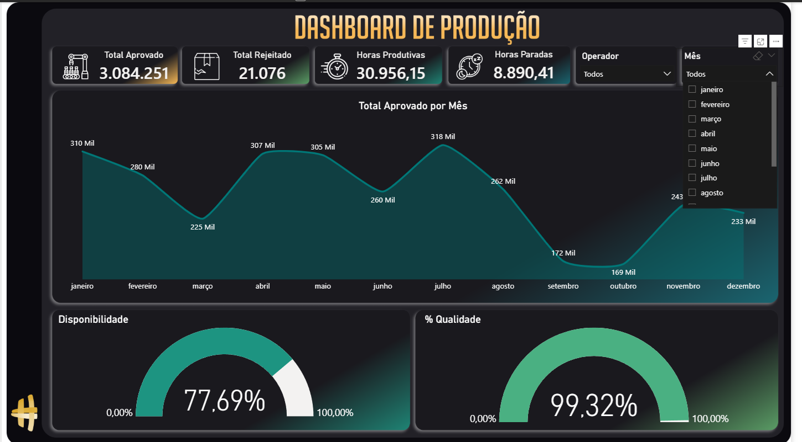

# Dashboard de Produção - Power BI

Dashboard desenvolvido para análise de indicadores da área de produção,
permitindo acompanhar volume produzido e desempenho operacional.

## Indicadores analisados

- Volume de produção
- Produção por produto
- Produção por período
- Indicadores operacionais

## Análises do dashboard

- Evolução da produção ao longo do tempo
- Comparação de desempenho entre produtos
- Análise de volume produzido por categoria

  
