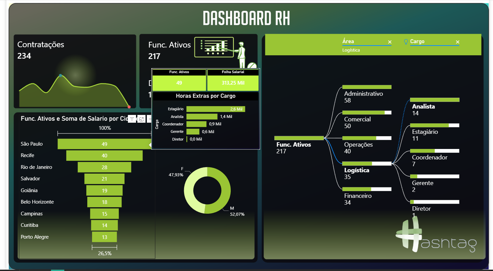

# Dashboard RH - Power BI

Dashboard desenvolvido para análise de indicadores estratégicos de
Recursos Humanos, permitindo acompanhar contratações, desligamentos
e distribuição de colaboradores na empresa.

## Indicadores analisados

- Contratações
- Funcionários ativos
- Funcionários desligados
- Turnover
- Horas extras por cargo

## Análises do dashboard

- Distribuição de funcionários por área (Administrativo, Comercial, Operação, Logística e Financeiro)
- Estrutura de cargos (Estagiário, Analista, Coordenador, Gerente, etc.)
- Funcionários ativos por gênero
- Funcionários ativos e soma de salários por cidade

  
