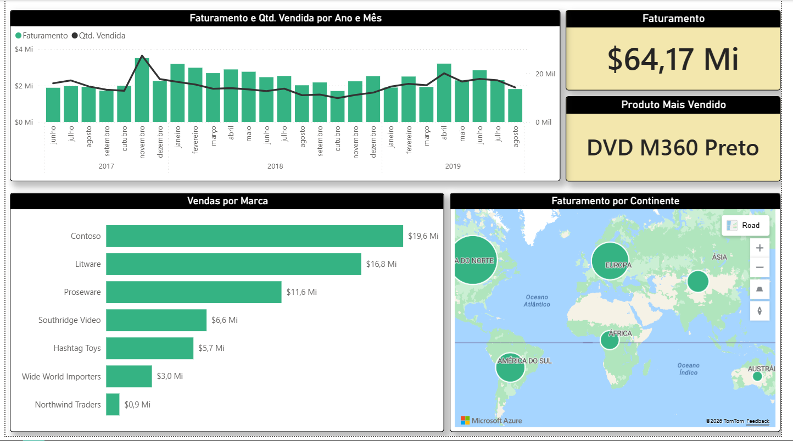

# Dashboard de Vendas - Power BI

Dashboard desenvolvido para análise de desempenho comercial,
permitindo acompanhar indicadores de vendas e faturamento.

## Indicadores analisados

- Faturamento
- Quantidade de vendas
- Desempenho por produto
- Desempenho por região

## Análises do dashboard

- Evolução das vendas ao longo do tempo
- Comparação de desempenho entre produtos
- Análise de vendas por região

  
